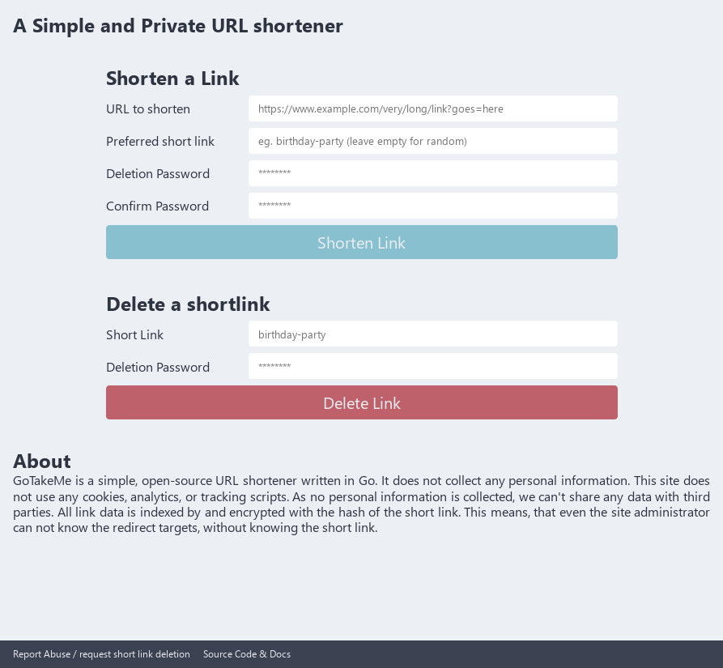

# GoTakeMe - A simple URL shortener
Gotakeme is a simple URL shortener written in Go.

It designed in a way, such that the stored redirects can not be extracted from the database without knowing the
short link.

## Usage
1. Create a cofiguration file. (See the [example config](example_config.json))
2. Compile `go build .`
3. Run `./gotakeme <your_config_file_path_here.json>`

## Configuration
| key | example | explaination |
|---|---|---|
|`base_url` | `"https://example.com/"` |The url the service will be running at. This MUST include a `/` at the end |
|`abuse_url` | `"mailto:abuse@example.com"` |Where the `Report Abuse` link should point to. |
|`listen_on` | `"127.0.0.1:8080"` | Where the server should listen `host:port` |
| `database_path` | `"/var/gotakeme"` | The storage location for the BadgerDB. This path will be created, if it does not exist.
|`admin_token` | `"VerySecretPassword"` | This password can be used to delete any short link. If this is not provided, a random one will be generated at runtime and logged to STDERR.

## Running in Production
Before running this in production, the following things must be addressed:
1. Provide a privacy policy, TOS, Imprint and other legal stuff. (This is the reason I am not personally hosting this externally.)
2. Use a reverse proxy for TLS, rate-limiting, and co.

## Project status
This project is done, and no longer actively being worked on. Gotakeme was created as a learning project, to get my feet wet developing Go.

## License
This project is licensed under the MIT license. See the [LICENSE](LICENSE) file.